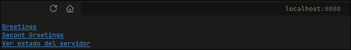
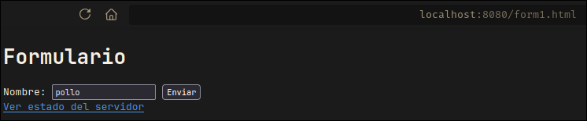
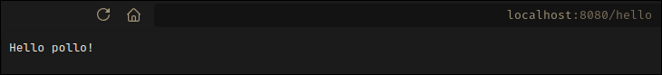
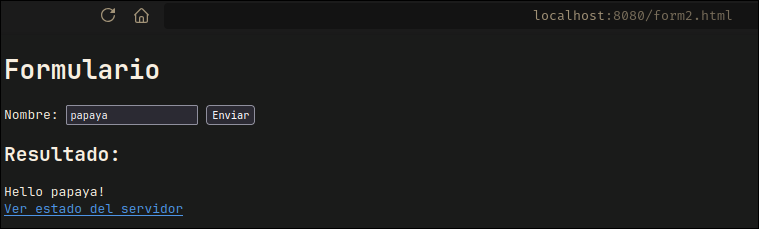

<div align="center">
  
<h1 align="center">Model View Controller</h1>
<p>
A simple Java project that implements the Model-View-Controller (MVC) architectural pattern.
</p>

</div>

</br>


## 🚀 Technologies Used

This project is built with the following technologies:

* **Java:** Used for all backend logic and application control.
* **HTML:** For the structure and content of the views presented to the user.
* **Maven:** For dependency management and project building.

</br>
</br>

## 🏁 Getting Started

To get a local copy up and running, follow these simple steps.
Ensure you have Java and Maven installed on your system.

### Installation

1.  Clone the repository:
    ```sh
    git clone [https://github.com/Andr3xDev/ARSW-MVC.git](https://github.com/Andr3xDev/ARSW-MVC.git)
    ```
2.  Navigate to the project directory:
    ```sh
    cd ARSW-MVC
    ```
3.  Build the project with Maven:
    ```sh
    mvn verify
    ```
4.  Run the application:
    ```sh
    mvn spring-boot:run
    ```


</br>
</br>

## ⚙️ How it Works

This project demonstrates the workflow of the Model-View-Controller (MVC) pattern through a simple web application. The user interaction is divided into three main screens that show how the components communicate with each other.
The MVC Flow

- Initial Request: When the user accesses the application, a Controller receives the request.
- Model Interaction: The Controller interacts with the Model to get the necessary data.
- View Selection: Once it has the data, the Controller passes it to a specific View to be rendered in HTML format.
- Response to User: The rendered View is sent back to the user's browser.
- User Actions: When the user performs an action (like submitting a form), the View sends the new data to a Controller, restarting the cycle.

### The 3 Screens

The application exemplifies this flow with the following screens:

- /index.html (Home and Form Screen)
    Purpose: This is the main screen. It presents the user with a simple form to enter data.
    Functionality: It's a static View that allows the user to send information to the backend through a form action (POST).



- /form1.html (Submitted Data Screen)
    - Purpose: To display the data that the user just submitted through the form.
    - Functionality: When the user submits the form from index.html, the Controller processes the data, packages it into a Model, and forwards it to this View. The view is responsible for dynamically rendering that information.





- /form2.html (Stored Data Screen)
    - Purpose: To display the complete list of all data that has been submitted and stored in the current session.
    - Functionality: A Controller gets the complete list of data from the Model and passes it to this View to display all the historical records.



